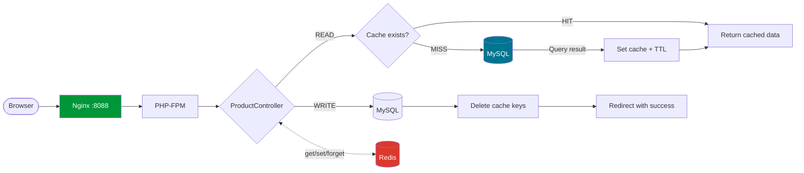

# Laravel Redis Cache Lab

A hands-on project demonstrating **Redis caching strategies** in a Laravel application. Built to explore real-world cache problems and their solutions using a product management system.

## Architecture



## Tech Stack

| Component | Technology | Purpose |
|---|---|---|
| Framework | Laravel 11 | Application logic |
| Cache Store | Redis 7 | Caching layer |
| Database | MySQL 8.0 | Persistent storage |
| Web Server | Nginx 1.25 | Reverse proxy |
| Runtime | PHP 8.2-FPM | PHP execution |
| Container | Docker Compose | Local development |

## Cache Problems Addressed

This project implements solutions for 5 critical real-world caching problems:

| # | Problem | Solution | Severity |
|---|---|---|---|
| 1 | **Stale Data** — Users see outdated data | Cache-Aside + TTL per data type | 🔴 High |
| 2 | **Cache Invalidation** — Cache not cleared on data change | Event-based deletion on write operations | 🔴 High |
| 3 | **Data Inconsistency** — Cache ≠ Database | DB-first write order + TTL safety net | 🔴 Critical |
| 4 | **Cache Stampede** — DB overload on cache expiry | Mutex Lock (only 1 request rebuilds cache) | 🔴 High |
| 5 | **Race Condition** — Concurrent writes cause data loss | Redis atomic operations (INCR/DECR/Lua) | 🔴 High |

> See [documents/cache-implementation-cases.md](documents/cache-implementation-cases.md) for detailed analysis with diagrams and code samples.

### Cache Strategy: Cache-Aside

```
READ path:                              WRITE path:
  ┌──────────┐                            ┌──────────┐
  │ Request  │                            │ Request  │
  └────┬─────┘                            └────┬─────┘
       │                                       │
  ┌────▼─────┐    HIT                    ┌────▼─────┐
  │  Redis   ├────────→ Response         │  MySQL   │ ← Update DB first
  └────┬─────┘                           └────┬─────┘
       │ MISS                                  │
  ┌────▼─────┐                           ┌────▼─────┐
  │  MySQL   │                           │  Redis   │ ← Then delete cache
  └────┬─────┘                           └──────────┘
       │
  ┌────▼─────┐
  │  Redis   │ ← Store with TTL
  └────┬─────┘
       │
    Response
```

## Additional Research

Beyond the 5 implemented cases, the following cache problems are documented for reference:

- Cache Penetration (queries for non-existent data)
- Cache Breakdown (hot key expiration)
- Cache Avalanche (mass key expiration)
- Connection Failure handling
- Cold Start recovery
- Memory Pressure and eviction policies
- Big Key problem

> See [documents/cache-common-problems.md](documents/cache-common-problems.md) for the full list of 12 problems with explanations.

## Getting Started

### Prerequisites

- Docker Desktop
- Git

### Quick Start

```bash
# Clone the repository
git clone <repository-url>
cd laravel-redis-cache

# Start all containers
docker compose up -d

# Install PHP dependencies
docker exec laravel_redis_app composer install

# Run migrations
docker exec laravel_redis_app php artisan migrate

# Seed sample data (100 products)
docker exec laravel_redis_app php artisan db:seed --class=ProductSeeder

# Open in browser
# http://localhost:8088
```

### Services

| Service | Container | Port |
|---|---|---|
| Web Application | laravel_redis_nginx | [localhost:8088](http://localhost:8088) |
| MySQL Database | laravel_redis_mysql | localhost:3308 |
| Redis Cache | laravel_redis_cache | localhost:6380 |
| PHP-FPM | laravel_redis_app | 9000 (internal) |

### Useful Commands

```bash
# Check Redis connection
docker exec laravel_redis_cache redis-cli PING

# Monitor Redis commands in real-time
docker exec laravel_redis_cache redis-cli MONITOR

# Check all cached keys
docker exec laravel_redis_cache redis-cli KEYS "*"

# Check Redis memory usage
docker exec laravel_redis_cache redis-cli INFO memory

# Clear all cache
docker exec laravel_redis_app php artisan cache:clear

# Run tests
docker exec laravel_redis_app php artisan test
```

## Project Structure

```
laravel-redis-cache/
├── app/
│   ├── Http/Controllers/
│   │   ├── ProductController.php        # CRUD with cache logic
│   │   └── ProductFilterController.php  # Filter with cache
│   └── Models/
│       └── Product.php                  # Product model with scopes
├── database/
│   ├── factories/ProductFactory.php     # Product factory
│   ├── migrations/                      # Database schema
│   └── seeders/ProductSeeder.php        # 100 sample products
├── resources/views/
│   ├── layouts/app.blade.php            # Main layout (Bootstrap 5)
│   └── products/                        # Product views
├── docker/
│   ├── nginx/default.conf              # Nginx configuration
│   └── entrypoint.sh                   # Container startup script
├── documents/
│   ├── cache-implementation-cases.md   # 5 cases to implement
│   ├── cache-common-problems.md        # 12 problems reference
│   ├── redis-cache-guide.md            # Redis cache guide
│   └── redis-cache-learning-roadmap.md # Learning roadmap
├── docker-compose.yml                  # Docker services
├── Dockerfile                          # PHP-FPM image
└── README.md                           # This file
```

## Routes

| Method | URI | Controller | Description |
|---|---|---|---|
| GET | `/` | — | Redirect to products |
| GET | `/products` | ProductController@index | Product listing |
| GET | `/products/create` | ProductController@create | Create form |
| POST | `/products` | ProductController@store | Store product |
| GET | `/products/{id}/edit` | ProductController@edit | Edit form |
| PUT | `/products/{id}` | ProductController@update | Update product |
| DELETE | `/products/{id}` | ProductController@destroy | Delete product |
| GET | `/filter` | ProductFilterController@index | Filter products |
